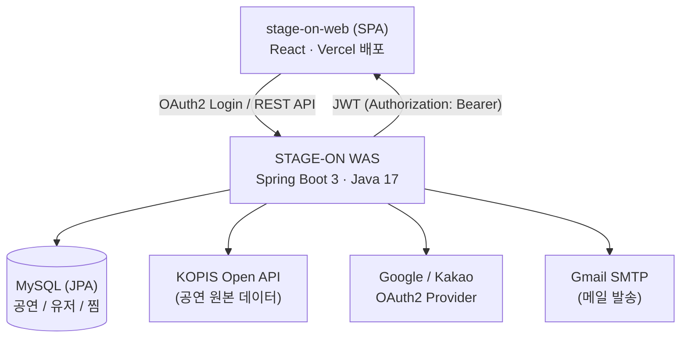

<div align="center">

# 🎤 STAGE-ON | WAS

**공연·페스티벌 통합 정보 & 개인 맞춤 타임테이블 서비스**

콘서트·페스티벌 정보를 한곳에서 검색하고, 아티스트를 팔로우하고, <br/>
겹치는 무대 속에서 "나만의 페스티벌 타임테이블"을 짤 수 있는 서비스의 백엔드(WAS) 저장소입니다.

[](https://openjdk.org/projects/jdk/17/)
[](https://spring.io/projects/spring-boot)
[](https://spring.io/projects/spring-security)
[](https://www.mysql.com/)
[](https://gradle.org/)
[](https://swagger.io/)
[](.github/workflows/deploy.yml)


</div>

---

## 📌 프로젝트 소개

**STAGE-ON**은 공연예술통합전산망(**KOPIS**) Open API의 방대한 공연 데이터를 가공하여, 사용자에게 **검색 → 팔로우 → 개인화**로 이어지는 경험을 제공하는 플랫폼입니다.

이 저장소는 그 중 **백엔드(WAS, Web Application Server)** 를 담당하며, 회원 인증부터 외부 공연 데이터 연동, 개인화 추천, 커스텀 타임테이블 저장까지의 API를 제공합니다.

> 페스티벌은 같은 시간대에 여러 무대가 동시에 진행됩니다. STAGE-ON은 이 문제에 주목해, 사용자가 보고 싶은 아티스트의 무대만 골라 담아 **자신만의 동선/시간표**를 만들 수 있도록 설계했습니다.

---

## ✨ 핵심 기능

| 기능 | 설명 |
|---|---|
| 🔐 **소셜 로그인 & JWT 인증** | Google / Kakao OAuth2 로그인, 로그인 성공 시 JWT Access Token 발급 및 프론트엔드로 리다이렉트 |
| 🔎 **공연 통합 검색** | KOPIS Open API를 연동해 공연/페스티벌 검색, 상세 조회, 아티스트별·기간별 검색 지원 |
| 🎯 **추천 & 최근 검색어** | 사용자별 최근 검색 기록 조회/삭제, 인기 공연 기반 추천 검색어 제공 |
| ❤️ **아티스트 & 공연 좋아요** | 관심 아티스트 팔로우, 공연/페스티벌 찜하기 및 내 찜 목록 조회 |
| 🗓️ **나만의 페스티벌 타임테이블** | 페스티벌 라인업 중 원하는 무대(슬롯)만 선택해 개인 맞춤 타임테이블로 저장 |
| 👤 **온보딩 & 프로필** | 최초 로그인 시 관심 아티스트 선택(첫 세팅), 마이페이지 프로필 조회 |
| 📧 **메일 발송** | Google SMTP 기반 이메일 발송 기능 |
| 📄 **자동화된 API 문서** | Springdoc(OpenAPI 3)로 모든 엔드포인트에 대한 Swagger 문서 자동 생성 |

---

## 🏗️ 아키텍처



- **레이어드 + 도메인 중심 패키지 구조**: `controller → service → repository` 계층을 `domain/{feature}` 단위로 응집하여 관리
- **Stateless 인증**: `JwtAuthenticationFilter`가 매 요청마다 토큰을 검증하고 `SecurityContext`에 인증 객체를 주입 (세션 미사용)
- **전역 예외 처리**: `GlobalExceptionHandler` + `ErrorCode`로 일관된 에러 응답 포맷 제공
- **CI/CD**: `develop` 브랜치 push 시 GitHub Actions가 Gradle 빌드 → EC2로 JAR 전송 → `systemctl restart`로 무중단에 가까운 배포 자동화

---

## 🧩 도메인 구성

```
domain
├── auth        # OAuth2 로그인, JWT 발급/검증, 프로필, 최초가입 체크
├── artist      # 아티스트 CRUD, 아티스트 찜(좋아요), 최초 관심 아티스트 선택
├── alonecon    # KOPIS 연동 공연/페스티벌 조회, 공연 찜, 커스텀 타임테이블(슬롯) 저장
├── allsearch   # 통합 검색 · 최근 검색어(history) · 추천 검색어(recommend)
├── email       # SMTP 메일 발송
└── common      # 도메인 간 공용 서비스
```

각 도메인은 `api`(Swagger 인터페이스) · `controller` · `service` · `repository` · `entity` · `dto` 하위 패키지로 통일된 구조를 따릅니다.

---

## 🛠️ 기술 스택

**Language & Framework**
`Java 17` · `Spring Boot 3.3.2` · `Spring Web` · `Spring WebFlux(WebClient)` · `Spring Data JPA` · `Thymeleaf`

**Auth & Security**
`Spring Security` · `OAuth2 Client (Google / Kakao)` · `JJWT 0.12` 기반 JWT 발급·검증

**Database**
`MySQL 8` · `Hibernate` (`ddl-auto: update`, 타임존 UTC 통일)

**External Integration**
`KOPIS(공연예술통합전산망) Open API` (WebClient 기반 연동) · `Gmail SMTP`

**Documentation & Tooling**
`springdoc-openapi (Swagger UI)` · `Lombok` · `Gradle`

**Infra & CI/CD**
`GitHub Actions` → `AWS EC2` (`systemd` 서비스로 운영), `Vercel`에 배포된 프론트엔드와 CORS 연동

---

## 📚 API 개요

전체 명세는 서버 실행 후 **Swagger UI**(`/swagger-ui/index.html`)에서 확인할 수 있습니다. 주요 엔드포인트는 다음과 같습니다.

| Method | Endpoint | 설명 |
|---|---|---|
| `GET` | `/api/v1/auth/login-check` | 최초 로그인 여부 확인 |
| `GET` | `/api/v1/profile` | 내 프로필 조회 |
| `POST` | `/api/v1/first/select` | 최초 관심 아티스트 선택 |
| `GET` | `/api/v1/search` | 공연/아티스트 통합 검색 |
| `GET` | `/api/v1/search/history` | 최근 검색어 조회 |
| `DELETE`| `/api/v1/search/history/{historyId}` | 검색 기록 삭제 |
| `GET` | `/api/v1/recommend` | 추천 검색어 조회 |
| `GET` | `/api/v1/kopis/performances/search` | KOPIS 공연 검색 |
| `GET` | `/api/v1/kopis/performances/detail/{mt20id}` | 공연 상세 조회 |
| `GET` | `/api/v1/festivals/{mt20id}/detail` | 페스티벌 라인업/타임테이블 조회 |
| `POST`| `/api/v1/festivals/{mt20id}/custom-slots` | 나만의 타임테이블(관심 슬롯) 저장 |
| `POST`/`DELETE` | `/api/v1/likes/artists/{artistId}` | 아티스트 찜하기 / 취소 |
| `POST`/`DELETE` | `/api/v1/likes/performances/{performanceId}` | 공연 찜하기 / 취소 |
| `GET` | `/api/v1/likes/my/concerts`, `/my/festivals` | 내가 찜한 공연 / 페스티벌 목록 |

---

## 🚀 시작하기

### 요구 사항
- JDK 17+
- MySQL 8
- KOPIS Open API 서비스 키, Google/Kakao OAuth2 Client 자격 증명

### 환경 변수

`src/main/resources/application.yml` / `application-oauth.yml`에서 아래 값을 환경 변수로 주입받습니다.

```bash
DB_HOST=localhost
DB_NAME=stageon
DB_USER=your_db_user
DB_PASSWORD=your_db_password

SMTP_USERNAME=your_gmail_address
SMTP_PASSWORD=your_gmail_app_password

JWT_SECRET_KEY=your_jwt_secret

GOOGLE_CLIENT_ID=...
GOOGLE_CLIENT_SECRET=...
KAKAO_CLIENT_ID=...
KAKAO_CLIENT_SECRET=...

KOPIS_SERVICE_KEY=...
```

### 실행

```bash
git clone https://github.com/stage-on/stage_on_WAS.git
cd stage_on_WAS
./gradlew bootRun
```

빌드:

```bash
./gradlew clean bootJar
```

서버가 기동되면 아래 주소에서 API 문서를 확인할 수 있습니다.

```
http://localhost:8080/swagger-ui/index.html
```

---

## 🔄 CI/CD

`develop` 브랜치에 push되면 GitHub Actions가 다음을 자동으로 수행합니다.

1. JDK 17 세팅 후 `./gradlew clean bootJar`로 빌드
2. 빌드된 JAR을 SSH/SCP로 EC2 개발 서버에 전송
3. `systemctl restart stageon`으로 서비스 재기동

자세한 워크플로우는 [`.github/workflows/deploy.yml`](.github/workflows/deploy.yml)에서 확인할 수 있습니다.

---

## 📝 커밋 컨벤션

| 타입 | 설명 |
| --- | --- |
| `feat` | ✨ 새로운 기능 추가 및 기존 기능 수정 |
| `fix` | 🐛 버그 수정 |
| `docs` | 📚 문서 및 주석 수정 |
| `style` | 🎨 코드 스타일 및 포맷팅 수정 |
| `refact` | ♻️ 기능 변화 없는 코드 리팩터링 |
| `test` | ✅ 테스트 코드 추가/수정 |
| `chore` | 🔧 패키지 매니저 및 기타 잡다한 변경(`.gitignore` 등) |
| `merge` | 🔀 브랜치 병합 |

```text
feat: 로그인 폼 생성 완료
fix: 회원가입 에러 수정
```

---

<div align="center">

Made with ☕ by the **STAGE-ON** team

</div>
